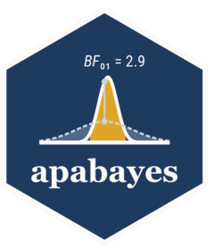

<!-- README.md is generated from README.Rmd. Please edit that file -->

# apabayes 

<!-- badges: start -->
<!-- badges: end -->

apabayes reports Bayesian and structural equation models in APA 7 form
inside [apaquarto](https://github.com/wjschne/apaquarto) documents:
inline strings for the running text and APA tables that render through
`apa7::apa_flextable()` to PDF, Word, HTML and Typst (Typst needs
apaquarto 6.0.0 or newer).

It reports `brmsfit` objects (and therefore `bmmfit`), `lavaan` and
`blavaan` fits, `brms::hypothesis()` output, `loo::loo_compare()`
output, `bayestestR::bayesfactor_models()` output and `emmeans`
posterior contrasts. Numbers come from the model’s own package and from
the easystats packages (`parameters`, `bayestestR`, `insight`); apabayes
selects, arranges and formats them, and every value it derives itself is
documented on the route that reports it.

One shape is currently out of reach upstream: a brms model with a matrix
response and a `trials()` term (`family = multinomial()`, which includes
every bmm M3 fit) fails inside `insight::get_data()` on R 4.3 or newer,
before apabayes sees a number. `apa_tidy()` says so and names the route
that works, `apa_tidy(brms::as_draws_df(fit))`; convergence statements
are unaffected.

The package is in development; 0.1.0 is the first planned release.

A worked apaquarto manuscript ships with the package, in
`inst/apaquarto-example/`, and the vignette “Reporting brms models in
apaquarto” walks through the whole API.

## Installation

The development version installs from GitHub once the repository is
public:

``` r
# install.packages("pak")
pak::pak("GidonFrischkorn/apabayes")
```

## Use

Every model class goes through `apa_tidy()` first, and everything after
that takes its result rather than the fit:

``` r
fit <- brms::brm(mpg ~ wt + am, data = mtcars)
posterior <- apa_tidy(fit)
```

The examples below use that table, stored with the package so that this
page builds without a compiler:

``` r
posterior <- readRDS(
  system.file("extdata", "parameters.rds", package = "apabayes")
)
```

Inline, in an apaquarto document:

``` r
apa_inline(posterior, "wt")
#> *b* = −5.39, 95% CrI [−6.95, −3.78], *pd* > .999
```

`apa_value()` returns the number rather than the string, for a value
that goes into arithmetic or into a sentence you format yourself:

``` r
apa_value(posterior, "wt", column = "ci_low")
#> [1] -6.953618
```

As a table, in a chunk with `#| label: tbl-fit`, `#| tbl-cap:` and
`#| apa-note:`. `apa_table()` formats the columns and headers, and
`apa_note()` defines whatever columns the table turned out to have:

``` r
tab <- apa_table(posterior)

apa7::apa_flextable(tab)
```

A chunk option is evaluated before its own chunk runs, so `tab` has to
be built in an earlier chunk than the one that prints it.

## Reporting from stored summaries

A fit is not needed. `apabayes_tidy()` is a public constructor, so a
table of stored posterior summaries — the shape most analysis pipelines
save — is reported the same way, and a manuscript knits without the
packages that made the fit:

``` r
stored <- data.frame(
  lhs = c("visual", "visual"), rhs = c("x1", "x2"),
  est = c(0.77, 0.42), lower = c(0.66, 0.29), upper = c(0.87, 0.55)
)

t <- apabayes_tidy(
  data.frame(
    term = paste0(stored$lhs, "=~", stored$rhs),
    estimate = stored$est, ci_low = stored$lower,
    ci_high = stored$upper, std = TRUE
  ),
  type = "parameters", centrality = "median", ci_method = "eti",
  ci_level = 0.95
)

apa_inline(t, "visual", "x2", op = "=~", symbol = "β")
#> *β* = .42, 95% CrI [.29, .55]
```

`apa_tidy()` reads a plain data frame of numeric columns as posterior
draws, one column per parameter, which is what makes a derived quantity
reportable — but it means any numeric data frame is read that way, so
pass draws, not raw data.

## What else is in it

`?apa_tidy` lists every object family it accepts. The format layer
(`apa_num()`, `apa_ci()`, `apa_bf()`, `apa_p()` and the rest) is usable
on its own, and `apa_print()` methods hand a tidy table to papaja.
